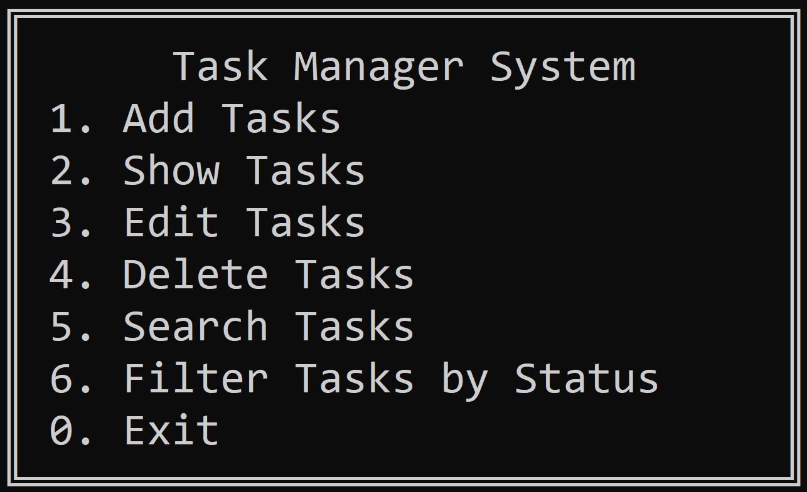

# 📋 Task Manager System 📋

## 📎 General Vision

O software permite aos usuários criar, visualizar e gerenciar suas tarefas e afazeres de maneira eficiente.

Criado utilizando a linguagem c++ o software visa agilidade e precisão na gravação das notas, também contém importante atenção para os processos de alteração das tarefas, exclusões e filtragem por status.

Com uma interface amigável no terminal busca entregar um uso simples no dia a dia, focando em hardwares de baixa potência e assim disseminar a organização para todos os públicos.

